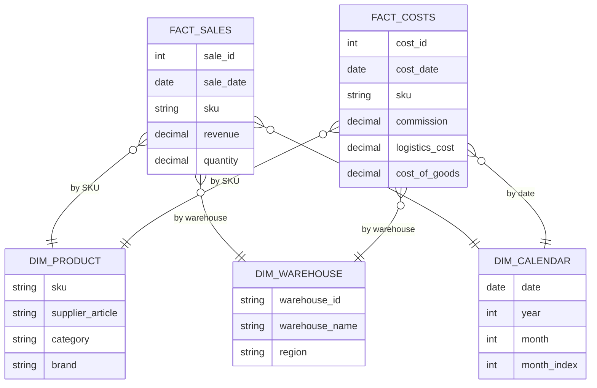
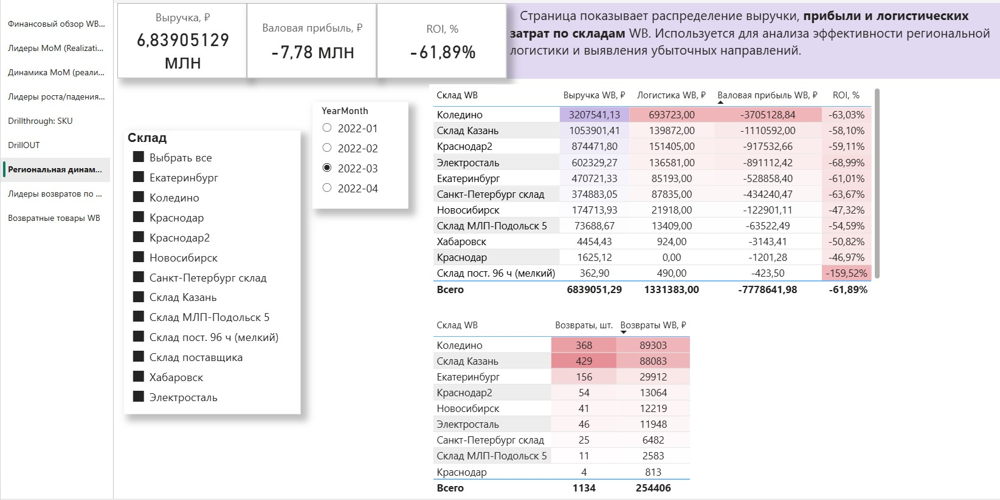
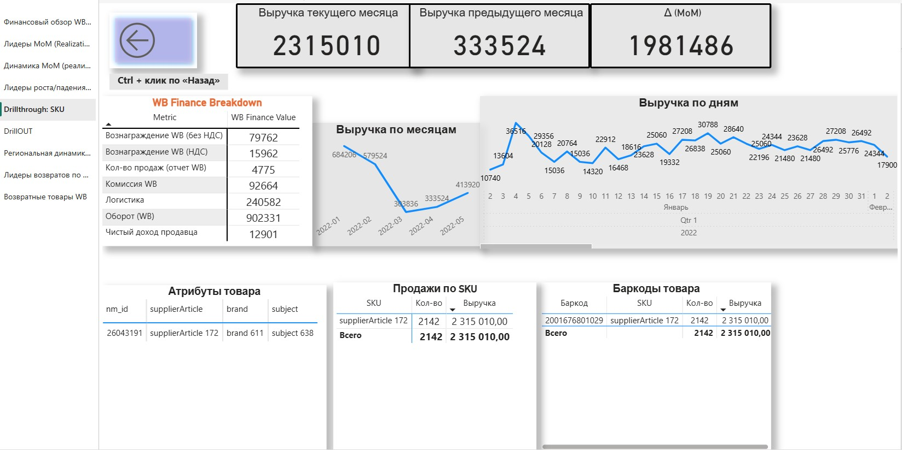

# PowerBI-WB-Analytics

Wildberries analytics project built in Power BI.

## Executive Summary

This project demonstrates an end-to-end Power BI analytical implementation:  
data modeling → time intelligence → drillthrough navigation → financial validation → data reconstruction under connectivity loss.

---

## Business Context

This project represents an analytical Power BI report built for a Wildberries (WB) marketplace seller.  
The primary goal is to analyze financial performance, identify revenue drivers and losses, and detect inefficient products and logistics operations.

The report is designed to support business decisions in the following areas:

- profitability control  
- operational efficiency  
- SKU-level performance monitoring  
- warehouse and logistics optimization  

---

## Data Sources & Model

The report is built on transactional Wildberries sales and realization data for the period:  
**December 2021 – May 2022**

### Key Data Layers

- sales and realization fact tables  
- commissions and logistics cost components  
- product attributes (SKU, supplier article)  
- warehouse and regional dimensions  
- calendar dimension with Month-over-Month logic  

---

## Model Architecture

The semantic layer follows a clean star-schema architecture designed for analytical clarity and stable KPI evaluation.

The model applies controlled filter propagation and avoids ambiguous relationships to maintain deterministic KPI behavior.

### Core Modeling Principles

- centralized fact tables  
- clearly separated dimension tables  
- role-playing calendar dimensions for MoM comparison  
- explicit relationships to prevent ambiguity in time intelligence  
- measure-driven analytical layer (DAX-based KPIs)  

The structure supports analytical performance through simplified relationship design and minimized calculation ambiguity.

---

## Time Intelligence Implementation

Time intelligence is implemented using DAX-based measures:

- Previous Month Revenue logic  
- Revenue Delta calculation  
- MoM percentage growth  
- Leader ranking by revenue change  

This ensures reproducible period-over-period comparison without ambiguity in temporal context.

---

---

## Model Diagram

Conceptual structure of the semantic layer:

The model follows a star-schema principle with centralized fact tables and conformed dimensions.  
KPI logic is implemented through DAX measures referencing the calendar dimension, ensuring deterministic time-based calculations and stable financial evaluation.

---

## Data Reconstruction & Model Resilience

During project execution, access to part of the original data sources was temporarily lost.  
Instead of stopping the analytical workflow, the report was reconstructed using:

- cached model artifacts inside PBIX  
- preserved transformation logic in Power Query  
- recalculated DAX measures  
- cross-checking revenue and cost components against prior model outputs  

Final financial metrics were reconciled and verified to ensure consistency with previously validated financial aggregates.  
All totals were revalidated to eliminate material discrepancies and ensure reconciliation integrity.

This demonstrates architectural transparency and resilience under disrupted data connectivity.

---

## Data Validation & Financial Control

The model includes validation checkpoints to ensure:

- consistency of revenue totals  
- alignment of commission and logistics cost components  
- reconciliation with validated financial summaries  
- integrity of MoM comparisons  

Financial KPIs were validated against aggregated totals before analytical conclusions were derived.  
All material variances were eliminated after reconciliation.

---

## Key Analytical Features

### Financial Overview

- revenue  
- gross profit  
- ROI  
- core cost components (WB commission, logistics, cost of goods)  

### Month-over-Month (MoM) Analysis

- identification of growth and decline leaders  
- comparison with previous periods  
- ranking of SKUs by revenue delta  

### SKU Drillthrough

- detailed product-level analysis  
- transition from summary KPIs to individual SKU performance  

### Logistics & Warehouse Efficiency

- profitability and ROI by warehouse  
- detection of unprofitable logistics directions  
- support for warehouse-level optimization decisions  

---

## Navigation & User Experience

The report is structured for different business roles:

- executives (high-level financial overview)  
- analysts (MoM dynamics and comparisons)  
- category managers (SKU drillthrough)  

Interactive features include:

- synchronized slicers  
- cross-filtering between visuals  
- drillthrough navigation from summary pages to detailed views  

Screenshots of key report pages and their analytical purpose are provided in the `docs/screenshots` section.

---

## Business Value

This Power BI report supports structured analytical decision-making for Wildberries marketplace operations.

The dashboard enables:

- rapid assessment of overall business performance  
- identification of revenue drivers and loss-making SKUs  
- detection of logistics inefficiencies  
- warehouse-level profitability analysis  
- drilldown from aggregated KPIs to SKU-level detail  

It helps answer practical business questions such as:

- Which products caused the largest revenue drop in the selected month?  
- Where do logistics costs significantly reduce profitability?  
- Which SKUs require pricing or assortment correction?  
- Which operational metric most strongly influences profit growth?  

---

## Power BI Report Access

Due to GitHub file size limitations, PBIX files are not stored directly in this repository.

Full Power BI report access:

- **Google Drive (PBIX files):**  
  https://drive.google.com/drive/folders/1zoEV2jGBrZNeaEx8QKa3gH0N4XxLiHag  

- Power BI Service (private workspace)

---

## Project Scope

- Month-over-Month (MoM) sales analysis  
- Leaders of growth and decline  
- Drillthrough analysis by SKU  
- Clean semantic model and DAX measures  
- Financial validation and reconciliation  

---

## Screenshots

See key report pages here:  
[docs/screenshots](docs/screenshots)

### Preview

- Finance overview  
  

- MoM leaders  
  

- Logistics ROI by warehouse  
  

- Drillthrough SKU  
  

---

## Tech Stack

- Power BI Desktop  
- DAX  
- Power Query (M)  
- Star-schema data modeling  

---

## Repository Structure

- `pbix/` — Power BI report files (metadata; PBIX stored in Google Drive)  
- `docs/` — business & technical documentation  
- `docs/screenshots/` — report screenshots  

---

## Notes

PBIX files are intended to be opened locally in Power BI Desktop.

---

## Author

Author: AvseHorosho  
GitHub: https://github.com/AvseHorosho
